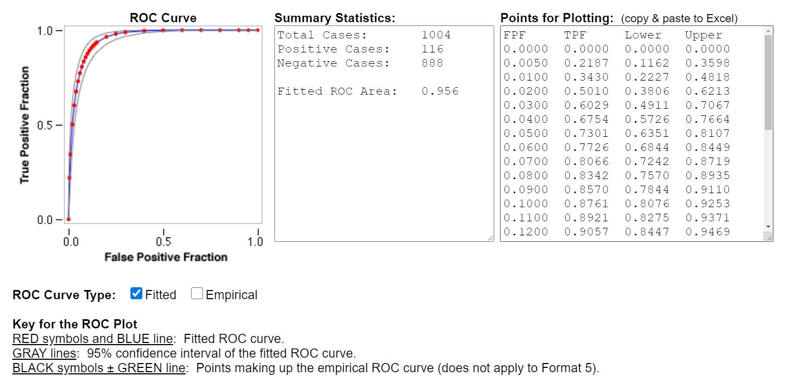

# HobbyRoute

	

The hobby recommendation Android app 'HobbyRoute' uses CF and CBF for the recommendation system, and Google Maps for search of routes to related places.   
<em>{This is a repository created to store and proceed with my Hobbyroute project created from July to December 2020.}</em>

<strong>Table of contents</strong>
1. Project outline
2. Goal of the project
3. Functional implementation and evaluation   
3-1. Recommendation system implementation   
3-2. Recommendation system evaluation   
3-3. Pathfinding system implementation   
3-4. Pathfinding system evaluation
4. Application UI
5. References

# Project outline

A solution to provide customized hobby content applying recommendation system and place & pathfinding algorithm, 'Hobbyroute' is a project that recommends customized hobbies services and contents, and presents relevant places that exist within the radius of user activity with an optimal route.   
Hobby-Route uses a personalized algorithm that uses a recommendation system that hybridizes CF(Collaborative Filtering) and CBF(Content-Based Filtering). This recommendation system is an algorithm adopted by various large-scale video platforms such as YouTube and Netflix as a way to increase the time spent by users. Personalized place recommendation considering time and space applies a route search algorithm using Hadoop Mapreduce and Google Map. In addition to the hobby service and the best recommendation for that place, Hobbyroute provides additional functions to enhance the convenience and utility of users.   
The measurement of the project's performance is done for each algorithm unit. The recommendation system measures accuracy using indicators such as TPR (True Positive Rate) and FPR (False Positive Rate), and creates a ROC Curve(Receiver Operating Curve) to make it easier to see the performance level. And I conducted a recommendation system survey in Google form to users who actually participated in the project. The number of actual users can be checked through Google Analytics. The best place suggestion algorithm directly tests a certain amount of paths or more, evaluates the recommended distance and optimality, and creates a comparison table with a system that provides similar functions.   

Dev. Language : Java, JS, PHP   
Dev. Environment : Android Studio, mariaDB

# Goal of the project

The goal of this project is to create an application form of an integrated solution that provides a recommendation algorithm based on user preferences, contents, and hobby and a place recommendation applying an optimal place and route search algorithm.   
Users can explore and present a customized hobby that suits them through HobbyRoute, and experience it in the most efficient way.   
HobbyRoute uses CF and CBF to recommend a hobby that users would prefer, finds a place related to the hobby and presents a route to that place. The aim of this project is to get high satisfaction and algorithm efficiency by recommending the most suitable hobby for users and providing efficient routes.

# Functional implementation and evaluation

### Recommendation system implementation
CBF is implemented as follows. The keywords of hobby selected by the user remain in the DB as a user log. Basic CBF is performed by calculating the distance between these keywords and the keyword string of the hobby. CF is implemented as follows. The hobby id selected by the user is also recorded as a log. By calculating the log string distance of users with similar keywords, the taste similarity is measured, and the CF is performed with the data.   
In project package, the main codes associated with this feature are <strong>BrowseActivity</strong>, <strong>Recommendation-Activity_normal</strong>, <strong>NboardActivity</strong>, <strong>DetailedActivity</strong>, <strong>RecycleAdapter</strong>, <strong>Hobby Class</strong>.   
Data is obtained from my domain, DB at <s>trueline.kr</s>(expired. I'll make new one), via php. The php file is in the web folder of the enclosed package.
The string similarity used for both filtering is calculated through the distance measurement function. Keywords in the log are separated by a separator. In this case, the weight of the keyword is higher as it is positioned in the front and recently selected.   
For example, if a user selects a hobby A that includes the keyword (a, b, c, d) and then selects a hobby B that includes the keyword (e, f, g, h), the keyword log is “e, f, g, h, a, b, c, d,” will remain in this order. At this time, the weight of the keyword 'e' at the front of the screen has the highest weight, and the next hobby recommendation is determined by prioritizing the keyword. Although the weight of the keyword 'a' of hobby A was relatively higher than that of the keyword 'h' of hobby B (a saying that a was frequently appeared as a decisive keyword in the classification of hobbies), the clue that 'the most recent' takes precedence when comparing keyword similarity. The 'h' value is weighted and used.   

### Recommendation system evaluation
This is a quantitative evaluation of the recommendation system, which is conducted through MAE and RMSE measurements. Currently, the expected recommended system data set is about 1000. Before testing the learned recommendation algorithm, the correlation of each data out of 1000 data is set at a rating between 0 and 10. The goal is to exceed 90% of the relevance. And when the algorithm recommends a hobby, the MAE and RMSE scores are calculated by comparing the relevance rating and the expected rating of the recommended content. The reasons for using both MAE and RMSE values are as follows. This is because it tries to take advantage of the data of MAE, which is robust to outliers, and of RMSE, which is easy to understand the learning scale.   

	

In quantitative terms, I achieved 95.6%. This is slightly higher than the 90 percent I targeted. The scores of about a thousand hobbies presented by the Hobby-Route algorithm were printed and collected, then the TPR and FPR results were calculated and the corresponding comparisons were presented as ROC curve. This indicator may differ from the results of new users who use the app very little, and the reason will be described below.   
ROC Curve drawn by calculating TPR and FPR based on the result of keyword similarity calculation. The curve is very close to the upper left corner, so the Fitted ROC Area is measured as 0.956. This means that compared to the existing log records, the newly recommended hobby exists within the expected value and is likely to be exposed to the top. Numerical evaluation was conducted after separately collecting similarity scores output as user test cases and setting a certain threshold based on keywords (0.122). However, in the case of new users, the length of the keyword log is short, so applying the threshold increases the FPR. Therefore, the user log used in the evaluation was targeted at user data that had been subjected to hobby recommendation and keyword log algorithm at least 10 times.

### Pathfinding system implementation
Searching places related to hobbies and suggesting routes were basically designed with reference to Google Maps API. Designates the property of the place related to each hobby in the hobby DB in advance, calls the same place as the designated property among all places within a certain radius based on the user's current location, and presents the route to the selected place. Places related to hobbies are classified by attribute values.   
The number of place attributes is about 30. And since the amount of address data supported by Google Maps is larger than that required by Hobby-Route, data mapping and reduction are essential. Hobby-Route collects address data found on the map, maps it by attribute, and calculates only the necessary data. This function was carried out with a solution supported by Google Maps API. Data selected only by specific attributes significantly reduces the time and resources required to perform user location-based location search.
In project package, the main codes associated with this feature are <strong>MapActivity</strong>.  

### Pathfinding system evaluation
The performance measurement of the optimal place and route search algorithm is performed through actual calculation values. It directly tests a certain amount of paths, evaluates the recommended distance and optimality, creates a comparison table with a system that provides similar functions, and divides it into the items of degree of improvement, accuracy, and creates a table index.   
The evaluation of the pathfinding system was conducted through comparison with other systems(Kakao map/Naver map) that provide similar functions. short-range recommendation performance is not good. Public transportation is optimized and presented and shows the same performance and efficiency as other services, but it does not properly suggest walking and driving routes. However, the long-distance recommendation performance showed the same or slightly better performance than other services. Here, the criterion of better performance is based on the accuracy of the route experienced by the users and developers of Hobby-Route in qualitative terms, and the time it takes to reach the proposed location in terms of quantitative terms.   

# Application UI

# References

Maps SDK, Directions API, Geocoding API, Places API : https://console.developers.google.com   
Volley : https://github.com/google/volley   
Glide : https://github.com/bumptech/glide   
